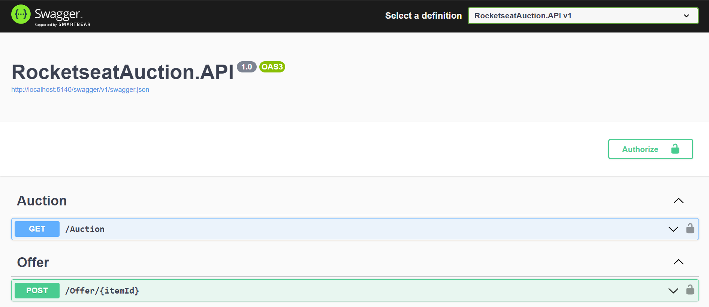

  <h1> Rocketseat Auction API</h1>

 

  

 
 

 <a href="#theproject">The Project</a> •
 <a href="#target">Target</a> •
 <a href="#technologies">Technologies</a> •
 <a href="#route">Route</a> •
 <a href="#howtouse">How to Use</a>

 

<h2> 📓 The Project </h2>

 Rocketseat Auction API to create your own auction and share it with friends

<h2> 💡 Target </h2>
Development of a Rocketseat Auction system API to create your own auction and share it with friends at NLW (Next Level Week), from Rocketseat

 

<h2> 🛠 Technologies </h2>
The following tools were used in building the project:  

|                      Type                       |       Tools       |              References               |
|:-----------------------------------------------:|:-----------------:|:-------------------------------------:|
|                       IDE                       |    VISUAL CODE    |    https://code.visualstudio.com/     |
|       API and backend services (Backend)        |      DOTNET       |     https://dotnet.microsoft.com/     |
| Open source API development ecosystem (Testing) |      POSTMAN      |       https://www.postman.com/        |
|          Unit test framework (Testing)          |        MOQ        |   https://github.com/devlooped/moq    |
|           Unit test package (Testing)           | FLUENT ASSERTIONS |     https://fluentassertions.com/     |
|          Fake data generator (Testing)          |       BOGUS       |     https://fluentassertions.com/     |
|               Database (Backend)                |      SQLITE       |   https://www.sqlite.org/index.html   |
|         DotNET ORM (Backend, Database)          | ENTITY FRAMEWORK  | https://learn.microsoft.com/en-us/ef/ |
|                    Security                     |        JWT        |            https://jwt.io/            |
|                API Documentation                |      SWAGGER      |          https://swagger.io/          |

 

  <h3>Backend | API</h3>
  
  
   
  <h3>Testing</h3>
  
   
  <h3>Database</h3>
  
   
  <h3>IDE</h3>
  
   

 

<h2> 🔎 Route </h2>
  <ol>
    <li &nbsp;>Part 1 - NLW Expert | Aula 01</li>
     
    <li &nbsp;>Part 2 - NLW Expert | Aula 02</li>
     
    <li &nbsp;>Part 3 - NLW Expert | Aula 03</li>
     
  </ol>

<h2>🧪 How to use</h2>
  <ol &nbsp;>
    <li &nbsp;>Set the development environment at you local computer</li>
    <li &nbsp;>Clone the repository 
      <ul>
        <li>git clone https://github.com/alexandrecpedro/rocketseat-auction</li>
      </ul>
    </li>
    <li &nbsp;>Enter the project directory: 
      <ul>
        <li>cd rocketseat-auction</li>
      </ul>
    </li>
    <li &nbsp;>Build the project: 
      <ul>
        <li>dotnet build</li>
      </ul>
    </li>
    <li &nbsp;>Run the project: 
      <ul>
        <li>dotnet run</li>
      </ul>
    </li>
  </ol>

